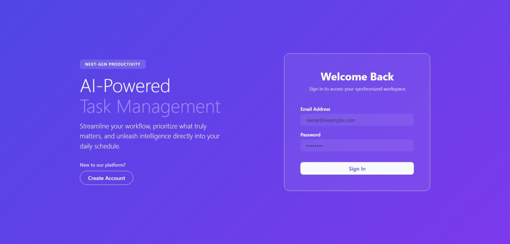
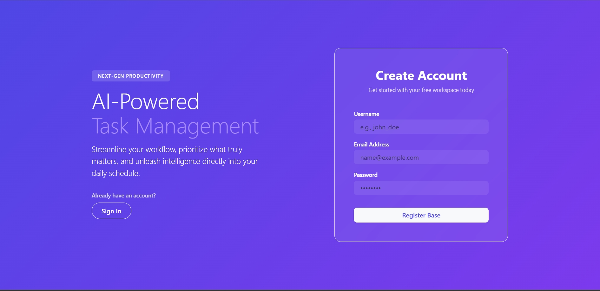
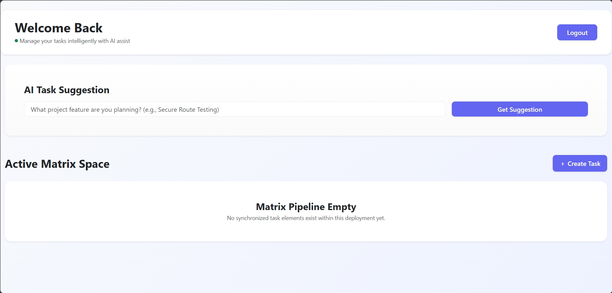
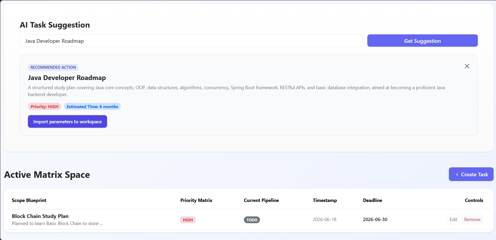
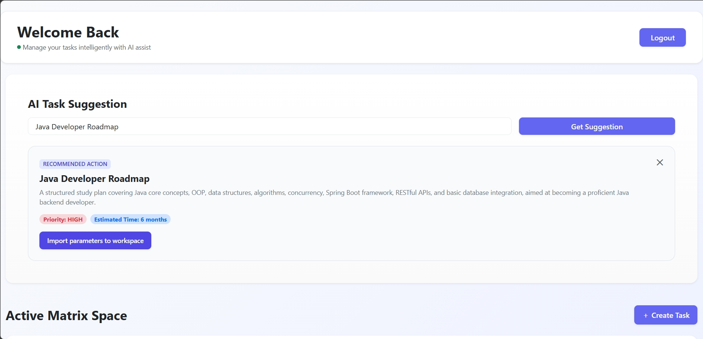
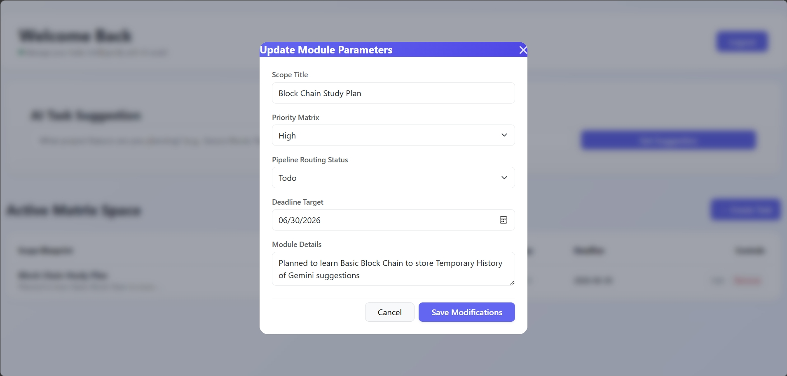

# AI Powered Task Management System

## Overview

AI Powered Task Management System is a full-stack web application that helps users organize and manage their tasks efficiently. The application integrates Gemini AI to generate structured task suggestions, recommend priority levels, and estimate completion timelines, allowing users to improve productivity and planning.

Users can register, log in securely using JWT authentication, create and manage tasks, and receive AI-powered recommendations directly from the dashboard.

---

## Live Demo

### Frontend (Vercel)

https://ai-powered-task-manager-one.vercel.app/

### Backend API (Railway)

https://ai-powered-task-manager-production.up.railway.app/

### GitHub Repository

https://github.com/Kishores2504/ai-powered-task-manager

---

## Features

### Authentication

* User Registration
* User Login
* JWT Authentication
* Secure API Access using Spring Security

### Task Management

* Create Tasks
* View Tasks
* Update Tasks
* Delete Tasks
* Track Task Status
* Manage Priority Levels
* Due Date Management
* Created Date Tracking

### AI Integration

* Generate AI-powered task recommendations
* Suggest task priorities
* Estimate task completion timelines
* Gemini AI integration

Example AI Response:

**Recommended Action:** Java Study Plan

**Description:**
A structured plan to learn Java from fundamental concepts (syntax, OOP) to intermediate topics (Collections, I/O, Concurrency, JDBC) and an introduction to modern frameworks like Spring Boot. Includes practice exercises and project work.

**Priority:** HIGH

**Estimated Time:** 6 Months

### User Experience

* Responsive Design
* Mobile Friendly Interface
* Desktop Optimized Layout
* Clean Dashboard Experience

---

## Tech Stack

### Frontend

* React
* React Router
* Axios
* Bootstrap
* HTML5
* CSS3
* JavaScript

### Backend

* Java
* Spring Boot
* Spring Security
* Spring Data JPA
* REST APIs

### Database

* MySQL

### AI Integration

* Gemini AI API

### Deployment

* Vercel (Frontend)
* Railway (Backend)
* Railway MySQL (Database)

---

## System Architecture

Frontend (React)
↓
REST APIs
↓
Spring Boot Backend
↓
Spring Security + JWT
↓
MySQL Database
↓
Gemini AI API

---

## User Workflow

1. User registers with:

   * Username
   * Email
   * Password

2. User logs in using:

   * Email
   * Password

3. JWT token is generated after successful authentication.

4. User is redirected to Dashboard.

5. User can:

   * Add tasks
   * Update tasks
   * Delete tasks
   * Track task status

6. User can request AI suggestions.

7. Gemini AI generates:

   * Task recommendation
   * Priority level
   * Estimated completion timeline

---

## Screenshots

### Login Page

### Register Page

### Dashboard

### Added Task

### AI Suggestion

### Task Management

### Update Task

---

## API Endpoints

### Authentication

POST /user/register

POST /user/login

GET /user/alltasks

POST /user/addtask

PATCH /user/updatetask/{id}

DELETE /user/deletetask/{id}

### AI Suggestions

POST /ai/taskSuggestion

---

## Local Setup

### Clone Repository

git clone https://github.com/Kishores2504/ai-powered-task-manager.git

### Backend Setup

1. Open project in Eclipse or IntelliJ IDEA
2. Configure MySQL database
3. Add environment variables
4. Run Spring Boot application

### Frontend Setup

npm install

npm run dev

---

## Environment Variables

Configure the following environment variables before running the application:

### Backend

DB_URL=

DB_USERNAME=

DB_PASSWORD=

JWT_SECRET=

GEMINI_API_KEY=

---

## Future Enhancements

* Task Analytics Dashboard
* Email Notifications
* Team Collaboration Features
* Dark Mode Support
* AI-Based Task Prioritization Improvements
* Task Progress Visualization
* Calendar Integration

---

## Author

Kishore S

Java Full Stack Developer

GitHub:
https://github.com/Kishores2504

---

## Project Status

Completed and Deployed

Frontend Hosted on Vercel

Backend Hosted on Railway

Database Hosted on Railway MySQL
